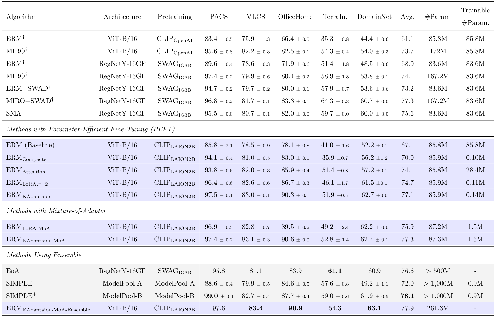

# Domain Generalization Using Large Pretrained Models with Mixture-of-Adapters (MoA)

[Paper](https://arxiv.org/abs/2310.11031) | [Project Page](https://ku-cvlab.github.io/MoA/)


### Prerequisites 

Dataset Preparation

```bash
python -m domainbed.scripts.download --data_dir=/my/datasets/path
```

Environment Setup

```bash
conda create -n MoA python=3.9.12
conda activate MoA
pip install -r requirements.txt
```

### Training
We use [OpenCLIP ViT-B/16](https://huggingface.co/laion/CLIP-ViT-B-16-laion2B-s34B-b88K) for all experiments. The pretrained model can be loaded from timm. You can use the following command to get the model.

```python
timm.create_model('vit_base_patch16_clip_224.laion2b', pretrained=True)
```

Full fine-tuning

```bash
python train_all.py [train_name] --data_dir [domainbed_data_dir] --algorithm ERM \
 --dataset DomainNet --model vitbase --seed 1
```

[LoRA](https://arxiv.org/abs/2106.09685)

```bash
python train_all.py [train_name] --data_dir [domainbed_data_dir] --algorithm ERM \
 --dataset DomainNet --model nf_vitbase_lora --r 2 --seed 1
```

Mixture-of-LoRA

```bash
python train_all.py [train_name] --data_dir [domainbed_data_dir] --algorithm ERM \
 --dataset DomainNet --model nf_vitbase_moelora_last_qkv --seed 1
```

[KAdaptation](https://arxiv.org/abs/2203.16329) + Mixture-of-Attention (our best results)

```bash
python train_all.py nf_vitbase_moelora_every_qkv_new_laux --data_dir [domainbed_data_dir] --algorithm ERM \
 --dataset DomainNet --model nf_vitbase_moek_every_qkv_new --l_aux --seed 1
```

### Results

<p align="center">
    
</p>

### Acknowledgements

This code is heavily based on [MIRO](https://github.com/kakaobrain/miro), [SWAD](https://github.com/khanrc/swad) and [DomainBed](https://github.com/facebookresearch/DomainBed). Also, the LoRA implementation is based on [LoRA](https://github.com/cloneofsimo/LoRA). We also used the official implementation of [KAdaptation](https://github.com/eric-ai-lab/PEViT), and the [Cosine Router](https://arxiv.org/abs/2206.04046) using [this](https://github.com/Luodian/Generalizable-Mixture-of-Experts) github. We highly appreciate the authors for their great work.

### Citation
If you found this code useful, please consider citing our paper.

```
@article{lee2023domain,
  title={Domain Generalization Using Large Pretrained Models with Mixture-of-Adapters},
  author={Lee, Gyuseong and Jang, Wooseok and Kim, Jin Hyeon and Jung, Jaewoo and Kim, Seungryong},
  journal={arXiv preprint arXiv:2310.11031},
  year={2023}
}
```